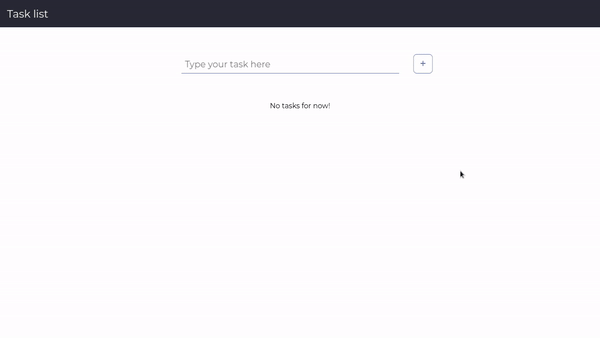

<div align="center">
    <br/>
    
    <br>
</div>

<br/>

# WPS - Task

<br/>

This project is a task list made with ReactJS. By now, it is static, but i intend to make it dynamic, using cookies and some API, or database. This repository has two projects. The "task-list" is a project made in react and it not uses Typescript. The "task-list-next" project uses NextJS and Typescript with ReactJS. Both projects do exactly the same thing.
  
 - To add a new task you just need type the new task and click on the "+" button or press Enter
 - To set a task as finished, just click on the "x".
 - To edit the task, just click in the pencil and edit the task

It is worth mentioning that, when cloning the repository, it is necessary to use the ```yarn``` command to load the modules and configure the application. After that, just run the ```yarn dev``` command to launch the software on localhost.

<br/>